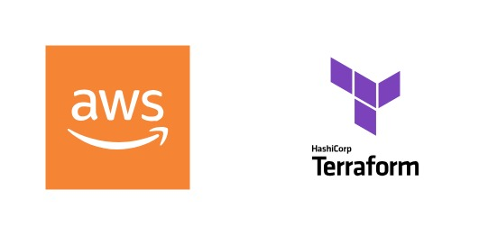

#  Terraform on AWS with SRE, IaC & DevOps

## How to run Terraform scripts

#### To download the required providers and plugins:
> terraform init

#### To validate the configurations:
> terraform validate

#### To format the configurations:
> terraform fmt

#### To generate an execution plan:
> terraform plan

#### To apply the changes:
> terraform apply

#### To destroy the infrastructure:
> terraform destroy